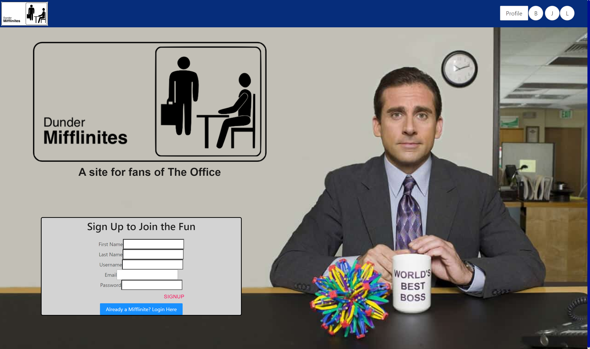
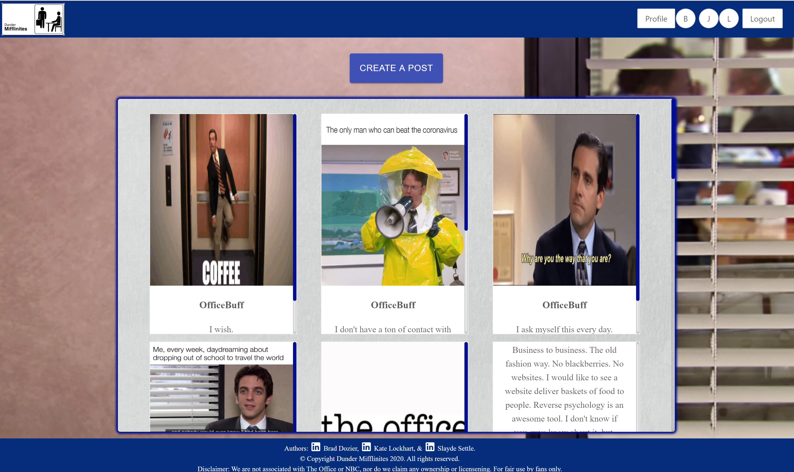

## What is Dunder Mifflinites?

Dunder Mifflinites is a collective project centering around the idea of creating a social media platform for fans of The Office. Here users can make a profile, post to a feed of all users posts, and comment on posts. We, the creators, wanted a space where we could discuss and revel in genius of The Office... and to find other people that would enjoy our jokes and memes.

### Quick Start

Feel free to clone and play around in the app! 

This is a React app written in Legacy code and Typescript. 
You will need to have all associated installations or run $npm update in your terminal to install all packages necessary for your machine to facilitate the code.

# User Role

Full crud capability with both feed posts and comments.

# Admin Role

Separate page acessed only by admin. Able to edit and delete any user, post, or comment.

# Client Endpoint Use

* 

Screenshots of each page section are as follows:

Initial Auth Page:

Home/Main User Feed:

User Profile:

Enjoy!

Wiki repository being developed for more detailed documentation.

### Disclaimer

We do not own or claim to own the rights to any content relating to The Office and NBC. We operate solely
under fair use as a fan site. If you plan to use content found on Dunder Mifflinites, attempt to get authorization from the owners. We are not liable for any copyright infringement.

### Troubleshooting

Dunder Mifflinites is a new application, you may encounter unexpected or unintended issues while running it. If that is the case, feel free to send us a pull request of suggested changes or comments. An FAQ page is in the works.

## Authors of Dunder Mifflinites

* **Brad Doizer** 
A recent Eleven Fifty Academy front end web development graduate, continuing his education with UX/UI. He's a grade A teammate and problem solver unafraid to tackle errors and bugs. Throughout the project he built out all auth components, admin capabilities, and their styling. Never was there a more patient and personable team member. 
Currently looking for any Junior Web Dev job opportunities and experience: https://www.linkedin.com/in/brad-dozier-956a09a4/

* **Slayde Settle**
A recent Eleven Fifty Academy front end web development graduate, continuing her education with their software development program. She has strong skills in styling, working through challenges, and generating ideas that many others may not. In Dunder Mifflinites she built the user profile, implemented router-dom, styled a number of components, and came up with the brilliant idea. Her spunk and energy make her a great addition to any team. 
Currently looking for any Junior Web Dev job opportunities and experience: https://www.linkedin.com/in/slayde-settle-b9547769/

* **Kate Lockhart**
A recent Eleven Fifty Academy front end web development graduate, continuing her education with their software development program. She plays hard and works harder to always get the job done. In this project, she created the server for the application and it's 4 databases, implemented the all user and profile feed, created the comment ability, built the Navbar & Footer, as well as styled throughout. She does her best to support her team mates and keep the project moving. 
Currently looking for any Junior Web Dev job opportunities and experience: https://www.linkedin.com/in/katelynlockhart/